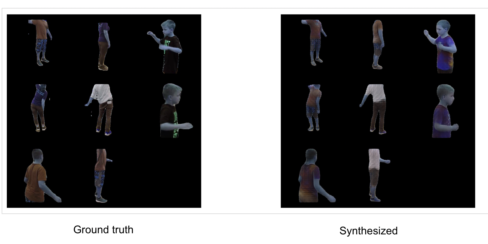

# Humbi challenge participation

This repository contains the code to tackle the [HUMBI challenge](https://competitions.codalab.org/competitions/35349#results).

It is based on the paper on Vunets for the pose synthesis:
[**A Variational U-Net for Conditional Appearance and Shape Generation**](https://compvis.github.io/vunet/images/vunet.pdf); source code for the [same](https://github.com/CompVis/vunet).

We added an additional GAN network layer. Below are some results on the training data of HUMBI.



We gained over 63% accuracy on the testing data.
## Requirements

The code was developed with Python 3. Dependencies can be installed with

    pip install -r requirements.txt

Generate pickle files for training data paths and joint order match using:
   ``` python pickle_file.py``` and update the config file ``ownconfig.yaml`` accordingly.

## Training / Testing

    python main_new.py --config owndata.yaml --mode test --checkpoint <path to checkpoint of first round>

## Contributors

> Tony Liu <liux4408@umn.edu> \
> Prithvi Raj Botcha <botch025@umn.edu> \
> Jiaqi Liu	<liu00687@umn.edu>

---